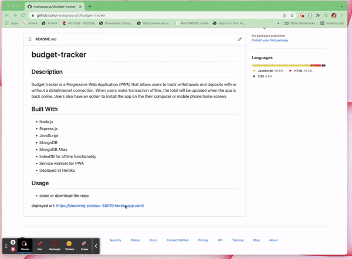

# budget-tracker
## Description
Budget tracker is a Progressive Web Application (PWA) that allows users to track withdrawals and deposits with or without a data/internet connection. When users make transaction offline, the total will be updated when the app is back online. Users also have an option to install the app on the their computer or mobile phone home screen. 

## Built With
* Node.js
* Express.js
* JavaScript
* MongoDB
* MongoDB Atlas 
* IndexDB for offline functionality
* Service workers for PWA 
* Deployed at Heroku

## Usage
* deployed url: https://blooming-plateau-56019.herokuapp.com/

## Installation 
* clone or download the repo
* MongoDB and Node.js required
* ```npm install ``` to install on dependencies
* ```npm start``` to start localhost and localhost:3001 to use

## Demo



